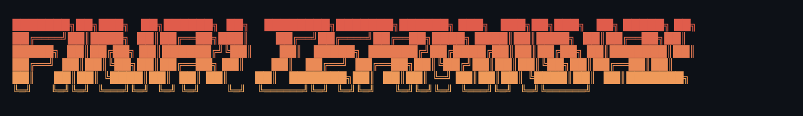

The analyst in your terminal. &nbsp; [](https://discord.gg/K9qDtng3hQ) [](https://finterminal.framer.website/)

FinR1 Terminal is a financial deep research terminal, aggregating public data across a single query language. Load an instrument and run functions - every figure is pulled from a free, key-less public source.

## Install & run

Requires **Python 3.10+** and **pip** - [python.org/downloads](https://www.python.org/downloads/) if you don't have it.

```bash
pip install git+https://github.com/Arnav-Gr0ver/FinR1-Terminal.git
finr1
```

## Usage

```
<FinR1 Terminal>  ❯  NVDA
<FinR1 Terminal NVDA>  ❯  price returns
```

Arrow keys + Tab complete instruments and functions. Chain any number of functions in one line.

<table>
<tr>
<td><b>Equity</b> - <code>NVDA price</code><pre>
╭─  NVDA  price  ───────────────────────────────────────╮
│                                                       │
│    NVIDIA Corporation   NASDAQ · equity               │
│                                                       │
│    Price     $202.17      Change    -5.66   (-2.72%)  │
│    Open      $202.16      Day       200.04 – 203.77   │
│    Volume    67.6M         Mkt Cap   $4.9T            │
│    52W       145.50 – 236.54                          │
│                                                       │
╰─────────────────────────────────────────────── 12:39 ─╯
</pre></td>
<td><b>Equity</b> - <code>NVDA returns</code><pre>
╭─  NVDA  returns  ──────────────────────────╮
│                                            │
│    NVIDIA Corporation   NASDAQ · equity    │
│                                            │
│    1 day     -2.72%     1 week    -4.11%   │
│    1 month   +6.38%     3 month   +9.24%   │
│    6 month   -9.47%     1 year    +40.0%   │
│    3 year   +461.3%     5 year  +1,840.2%  │
│                                            │
╰──────────────────────────────────── 12:39 ─╯
</pre></td>
</tr>
</table>

## Data sources

125 sources across 13 categories - all free, no API keys.

| Group | Category | What's available |
|-------|----------|-----------------|
| **Markets** | Equity / ETF | Price, chart, financials, earnings, options, short interest, filings, sentiment, alt-data |
| | Index | Price, chart, constituents, CFTC positioning |
| | Commodity | Price, chart, supply, CFTC positioning, weather, solar resource |
| | FX | Price, chart, carry, CFTC positioning, Big Mac index |
| **Economy** | Country | GDP, inflation, trade, debt, unemployment, CO₂, military spend, health, governance |
| | Macro | FRED series - CPI, DGS10, M2, UNRATE, FEDFUNDS, PCE and 20+ more |
| **Crypto** | Crypto | Price across 31 exchanges, funding rates, implied vol, sentiment |
| | Chain | TVL, DEX pairs, governance |
| | Protocol | Fees, DEX pairs, governance |
| | Stablecoin | Price, depeg monitoring |
| **Other** | Exchange | Market hours, holidays |
| | Topic | News, Google Trends, risk signal, Stack Overflow activity |

## Roadmap

| Version | Milestone |
|---------|-----------|
| **v0.1.0** | Public data terminal |
| **v0.2.0** | Agent harness · hosted model |
| **v0.3.0** | Agent mode - AI runs terminal commands to research and synthesize |
| **v0.4.0** | Data quality and depth expansion · 250 sources |
| **v0.5.0** | Benchmark terminal accuracy · public report |

## Disclaimer

The code shared in this repository is under the MIT license. Nothing herein constitutes financial advice or a recommendation to trade real money. Users are solely responsible for any financial decisions made using this software. Consult a qualified professional before deploying capital.